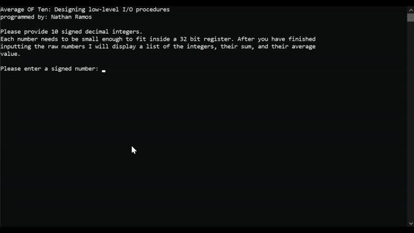

# Average Of Ten

A lower level I/O project

This project designs and implements calling low-level I/O procedures. 

Conversion procedures written in MASM Assembly for x86 IA-32 ISA

The project makes use Irvine library procedures for writing to the terminal window. All reading and writing procedures are handled by individual macros. The project displays good modularization by the use of procedures for individual tasks. Includes well designed error validation for incorrect string input.

The program takes a string input from user and validates string value to see if the input is a valid 32-bit signed integer. The program does this by converting the string's ASCII digits to its numeric integer value representation. If the string input is not a valid integer or is too large to fit into a 32-bit signed register, the input is rejected. The program stores 10 valid integers from the user in an array and calculates sum and average of array. It then converts the array of signed integers as well as sum and average to a string and prints output to the terminal window.

The demonstration below shows how the program is run in the terminal window. As the program takes the ten signed integers, it will reject any input that is not an integer or if it is too large. After the ten valid integers are entered, 

